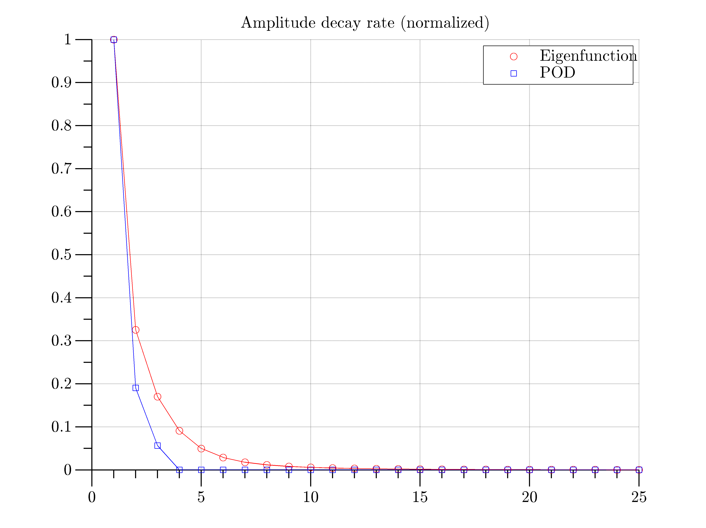

# Pulsating Poiseuille flow

In this exercise, I was using *Proper Orthogonal Decomposition* (POD) and *Eigenfunction Expansion* to approximate the velocity profile in the pulsating Poiseuille flow.

I compared the approximation with one, two and three first modes.

## Problem description

Problem:

	* suppose the pressure gradient in a Poiseuille flow is not constant but changing sinusoidally in time
	* how will the velocity profile change in time?

Program calculates the pulsating velocity profile in three ways:

	* using original solution from Asymptotic Complex Solution
	* using approximation by Eigenfunction Expansion
		- using MODES number of modes
	* using approximation by POD					
		- using RANK to represent the rank of the approximation matrix

Program draws:

	* first few spatial and temporal modes for the POD and Eigenfunction Expansion
		- their number can be specified by user, 3 by default
	* two movies for pulsating velocity profile
		- one with the original solution and MODES first approximations using eigenfunction
		- one with the original solution and RANK first approximations using POD
	* graph of amplitude decay for
		- eigenfunction solution
		- POD

## Amplitude decay

